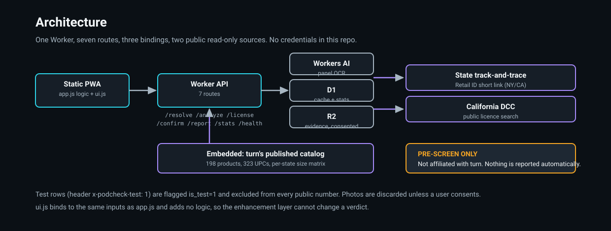
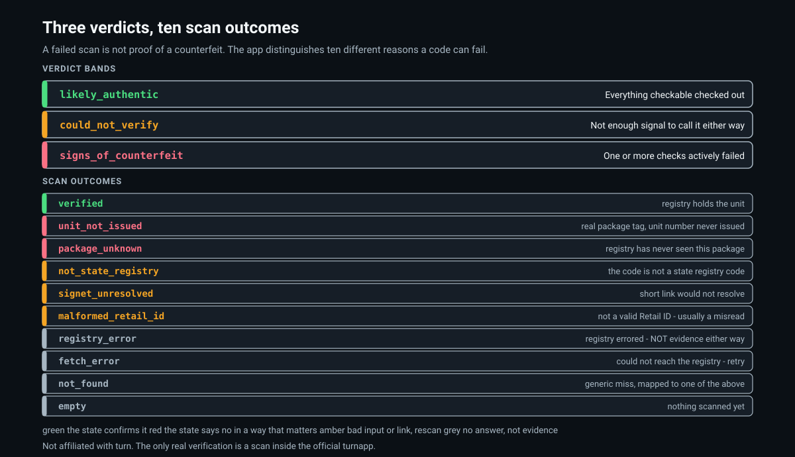
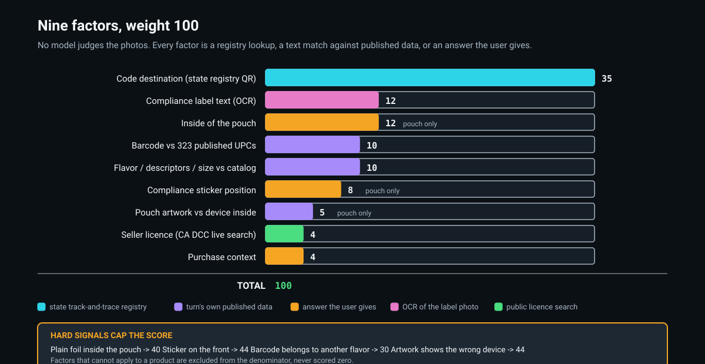
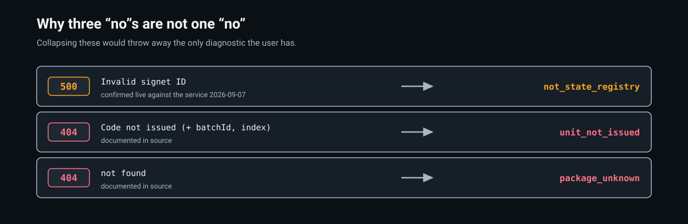

# PodCheck

**Scan the code. Ask the state, not the box.**

PodCheck is a free, independent pre-screen for turn-brand vape packaging - **pods and all-in-ones**. The state
registry scan covers **New York and California**; turn's own packaging checks cover every market turn sells in
(NY, CA, AZ, FL and its online hemp line).
It is **not affiliated with turn**. The only real verification is the official turnapp scan; PodCheck is the
homework before it.

Live: https://podcheck.vibemaestro.app



## What it does

Every legal unit in NY and CA carries a **Metrc Retail ID** - a state track-and-trace code printed as a QR.
PodCheck reads that QR in the browser and asks the state registry directly:

1. **Verified** - the registry has the unit. The app shows what the state says is in the box (product, brand,
   producer licence, packaging/expiry dates, testing lab, THC/CBD totals, terpenes, COA link, recall status)
   and asks the one question that matters: *does this match the package in your hand?*


2. **Not verified** - the app says *which kind* of no:
   - `not_found / unit_not_issued` - a real state package tag, but a unit number the state never issued
     (the copied-code-with-a-changed-number pattern)
   - `not_found / package_unknown` - a package the registry has never seen
   - `not_state_registry` - the code is not a state registry code at all
   - `malformed_retail_id` - the text is not a valid Retail ID (usually a misread; rescan)
   - `registry_error / fetch_error` - the registry was unreachable; not evidence either way, retry
3. **turn's own checks** (v2.0, for units with no code or bought where codes differ) - nine deterministic factors,
   no image-recognition guesswork. Each is a registry lookup, a text match against turn's published data, or an answer
   about the physical package. Factors that do not apply to a product are left out of the denominator, never scored zero.



   | factor | weight | what it measures |
   |---|---|---|
   | `qr` | 35 | Metrc Retail ID resolved server-side (NY/CA) |
   | `inside` | 12 | inside foil carries turn's logo pattern (pouch products) |
   | `sticker` | 8 | state compliance sticker position (pouch products) |
   | `artwork` | 5 | pouch window silhouette (pod + "pen sold separately" vs pen) matches the device inside |
   | `upc` | 10 | barcode under the label is one turn publishes for its own products (323 UPCs) |
   | `catalog` | 10 | flavor name + its three lines + size + up/down match turn's catalog (198 products, per-state size matrix) |
   | `panel` | 12 | compliance-panel text read from a photo vs California panel rules |
   | `license` | 4 | seller licence / store name looked up live in the California DCC database |
   | `context` | 4 | where it was bought and what was paid |

   Devices: `podpak`, `disposable` (all-in-one, same pouch family as the pod), `disposable_tin` (NY 100% live resin
   all-in-one, ships in a tin - pouch checks skipped), `turnone` (not in turn's asset hub - pouch and size checks
   skipped), `hemp_podpak` / `hemp_disposable` (online hemp line, no state registry). Verdict bands are unchanged:
   `likely_authentic` / `could_not_verify` / `signs_of_counterfeit`, 0-100, plus a `lean` hint when too little was measured.
4. **Evidence walkthrough** - photos of the panel and code, live licence lookup, purchase context, then a
   drafted report the user sends themselves (turn + the state regulator). Nothing is ever sent automatically.

## How the registry lookup works (measured, not assumed)

The label QR encodes an uppercase base-36 short link `https://1a4.com/<signetId>`. That service answers a
302 to `https://app.1a4.com/landingpage/<issuanceId>/<index>`, a React SPA whose data comes from
`GET https://app.1a4.com/api/landingpage/data?id=<issuanceId>&index=<n>` (no auth). Notes:

- `coaCard.data` is a **JSON string**, not an object - parse it twice.
- `regulatoryCard` is null for California units and populated for New York units.


- The short-link service has three distinct rejection shapes: `500 "Invalid signet ID"`,
  `404 "Code not issued"` (with `batchId` + `index`), and `404 "not found"`. The worker maps each to a
  different outcome so users are told the truth about *why* a code failed.

All of this lives in `worker/podcheck-api.js` (`parseRetailId`, `followSignet`, `resolveRetailId`).

## Where turn's catalog and barcodes come from (measured, not assumed)

turn's brand asset hub is a public Brandfolder with an unauthenticated JSON API. 644 of its assets carry structured
metadata (flavor, oil, effect, device, size, state, UPC). Merged with turn.me's own flavor listings that gives the
`CATALOG` (198 products) and `UPC_MAP` (323 barcodes) embedded in the worker, plus a per-state device x size matrix.
The same renders show that the all-in-one ships in the same pouch as the pod - only the window silhouette differs -
and that NY live-resin all-in-ones come in a tin, which is why the device selector changes which checks apply.

## Architecture

```
app/        static PWA (vanilla JS, no framework, inline SVG icons, no emoji)
            app.js  = all logic and API calls          ui.js = enhancement layer only (tiles, segmented controls,
            live /health facts, animated result ring)   - binds to the same inputs, adds no logic
worker/     Cloudflare Worker API: /resolve (registry), /analyze (nine factors), /license (CA DCC), /confirm,
            /report, /stats, /health.  Embedded CATALOG + UPC_MAP + size matrix from turn's public asset hub.
            bindings: AI (Workers AI), DB (D1), EVIDENCE (R2)
```

Stats are anonymous counts only. Rows written with the header `x-podcheck-test: 1` (or `via=test`) are
flagged `is_test=1` and excluded from every public number.

## Deploy

1. Create a D1 database and apply `worker/schema.sql`.
2. Create an R2 bucket for evidence photos.
3. Copy `worker/wrangler.example.toml` to `wrangler.toml`, fill in ids, `wrangler deploy`.
4. In `app/app.js` set `BASE` and in `app/ui.js` set `API` to your worker URL; host `app/` on any static host.
5. `app/index.html` references `og-card.png` for its share card - supply your own or remove the tags.

## Scope and honesty

- The registry scan is NY and CA only - the markets where packaging carries a Metrc Retail ID. A registry hit for
  any other state is shown with an "untested state" banner rather than celebrated. turn's own checks work for every
  pod and all-in-one turn sells; the online hemp line has no state registry at all, so it is checked on packaging only.
- turn one packaging is not in turn's asset hub, so it gets registry, barcode and catalog checks only.
- Licence lookup on the evidence path uses the California DCC public search; a New York OCM lookup is not wired.
- A failed scan is **not proof of a counterfeit**. Codes get misprinted, registries have outages. The app says so.
- 21+.

## Built how

Started as a one-sentence prompt in a vibe-coding studio on the afternoon of Sep 7 2026 and iterated with an
AI agent doing the building, checking real state-registry responses and turn's own published data as it went.
v2.0 (same evening) made it universal across turn's product line and rebuilt the front end as a mobile-first app.

## Licence

MIT - see [LICENSE](LICENSE).
